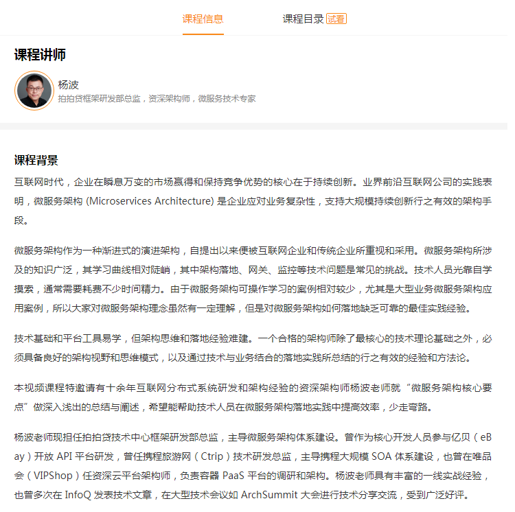

# GeekTimeMicroServiceNotes
**记录在《极客时间》平台上《微服务架构核心20讲》专栏的学习笔记**  
**作者信息：杨波 拍拍贷框架研发部总监**    
[极客时间微服务架构课程链接](http://gk.link/a/1000w)   
**课程简要介绍如下：**  
 
    
 
# 目录
* [第1讲 什么是微服务架构？](#1)
* [第2讲 架构师如何权衡微服务的利弊？](#2)
* [第3讲 康威法则和微服务给架构师怎样的启示？](#3)
* [第4讲 企业应该在什么时候开始考虑引入微服务？](#4)
* [第5讲 什么样的组织架构更适合微服务](#5)
* [第6讲 如何理解阿里巴巴提出的微服务中台战略](#6)
* [第7讲 如何给出一个清晰简洁的服务分层方式](#7)
* [第8讲 微服务总体技术架构体系是怎样设计的](#8)
* [第9讲 微服务最经典的三种服务发现机制](#9)
* [第10讲 微服务API服务网关原理（一）](#10)
* [第11讲 微服务API服务网关开源网关Zuul(二)](#11)
* [第12讲 跟Netflix学习微服务路由发现体系](#12)
* [第13讲 集中式配置中心的作用和原理是什么](#13)
* [第14讲 微服务通讯方式RPC vs REST](#14)
* [第15讲 微服务框架需要考虑哪些治理环节](#15)
* [第16讲 微服务监控系统分层和监控架构](#16)
* [第17讲 微服务的调用链监控该如何选型](#17)
* [第18讲 微服务的容错限流是如何工作的](#18)
* [第19讲 Docker容器部署技术&持续交付流水线](#19)
* [第20讲 容器集群调度和基于容器的发布体系](#20)
* [相关技术](#21)
* [相关书籍](#22)
* [完结](#99)

# 正文
<h2 id="1">第1讲 什么是微服务架构？</h2>
<h2 id="2">第2讲 架构师如何权衡微服务的利弊？</h2>
<h2 id="3">第3讲 康威法则和微服务给架构师怎样的启示？</h2>
<h2 id="4">第4讲 企业应该在什么时候开始考虑引入微服务？</h2>
<h2 id="5">第5讲 什么样的组织架构更适合微服务</h2>
<h2 id="6">第6讲 如何理解阿里巴巴提出的微服务中台战略</h2>
<h2 id="7">第7讲 如何给出一个清晰简洁的服务分层方式</h2>
<h2 id="8">第8讲 微服务总体技术架构体系是怎样设计的</h2>
<h2 id="9">第9讲 微服务最经典的三种服务发现机制</h2>
<h2 id="10">第10讲 微服务API服务网关原理（一）</h2>
<h2 id="11">第11讲 微服务API服务网关开源网关Zuul(二)</h2>
<h2 id="12">第12讲 跟Netflix学习微服务路由发现体系</h2>
<h2 id="13">第13讲 集中式配置中心的作用和原理是什么</h2>
<h2 id="14">第14讲 微服务通讯方式RPC vs REST</h2>
<h2 id="15">第15讲 微服务框架需要考虑哪些治理环节</h2>
<h2 id="16">第16讲 微服务监控系统分层和监控架构</h2>
<h2 id="17">第17讲 微服务的调用链监控该如何选型</h2>
<h2 id="18">第18讲 微服务的容错限流是如何工作的</h2>
<h2 id="19">第19讲 Docker容器部署技术&持续交付流水线</h2>
<h2 id="20">第20讲 容器集群调度和基于容器的发布体系</h2>
<h2 id="21">相关技术</h2>
<h2 id="22">相关书籍</h2>
<h2 id="99">完结</h2>

## 觉得有价值 感谢支持
 